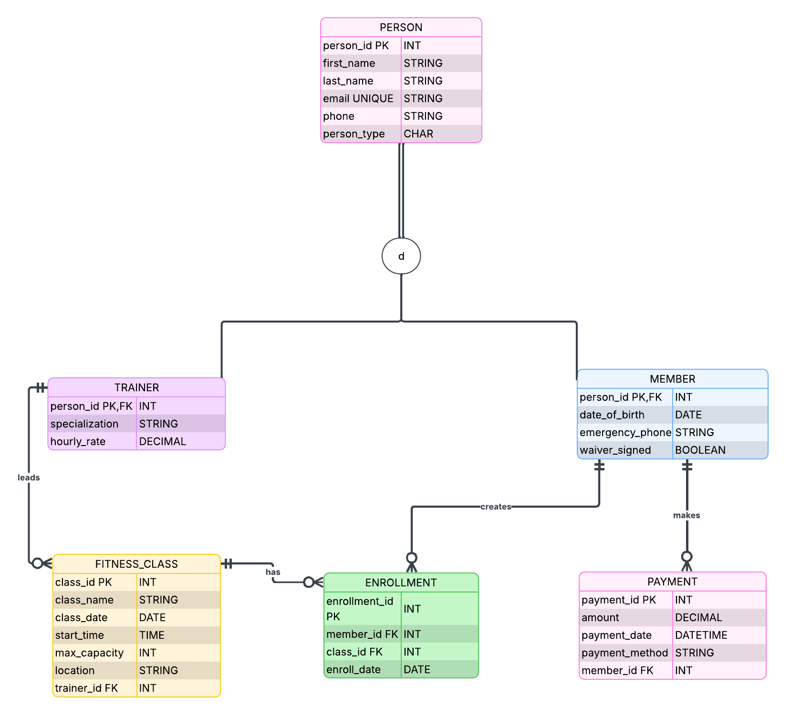

# DBAD-4000 Activity 1 – Gym & Fitness Centre

## Group
Combined Group 4 and Group 7

## Design Process

We started by reviewing the gym scenario and identifying the main data
the system needs to manage.

As a team, we brainstormed questions about members, trainers, classes,
enrollments, payments, relationships, and specialization. We discussed
different options and made our final decisions together.

Based on these decisions, we selected six entities: PERSON, MEMBER,
TRAINER, FITNESS_CLASS, ENROLLMENT, and PAYMENT. We then defined the
attributes, PK/FK, relationships, cardinalities, and participation.

We reviewed the design up to 3NF and created the final EERD in Lucidchart.

**Modelling Tool:** Lucidchart

## Business Rules

1. Every PERSON must be either a MEMBER or a TRAINER, but not both.
2. A TRAINER can teach many FITNESS_CLASS sessions, but each class has one trainer.
3. A MEMBER can enroll in many classes, and each class can have many members.
4. Each ENROLLMENT connects one MEMBER to one FITNESS_CLASS. The combination of `member_id` and `class_id` must be unique.
5. A MEMBER can make many PAYMENT records, but each PAYMENT belongs to one MEMBER.
6. A MEMBER must be at least 16 years old and have a signed waiver before enrollment.

## Design Rationale

PERSON is used as a supertype to avoid repeating common information in
MEMBER and TRAINER. The specialization is Total and Disjoint.

ENROLLMENT resolves the M:N relationship between MEMBER and FITNESS_CLASS.
PAYMENT is stored separately because one member can make many payments.

The design was reviewed up to 3NF to reduce duplicated data.

## EERD

The final EERD was created using Lucidchart.

## Team Contributions

| Team Member | Main Task |
|---|---|
| Majd | Business rules and entities |
| Vivek | Attributes, PK/FK, relationships, cardinalities and participation |
| Saihaj | Normalization to 3NF and design review |
| Christopher Findlay | EERD design in Lucidchart |
| Duy Pham | Database design, documentation and data dictionary |

All team members participated in brainstorming and reviewed the final
database design together.

## AI Use

ChatGPT was used as a support tool during our design process. Our team
brainstormed database questions based on the scenario and concepts learned
in class. AI was also used to suggest some general ideas and check English
wording.

The team discussed the questions, compared different options, and made
the final database decisions. The final design and EERD were reviewed
and agreed on by the team.

## Files

- [Final PDF Report](docs/DBAD4000-Activity1-Report.pdf)
- [EERD Image](imgs/gym-fitness-eerd.png)